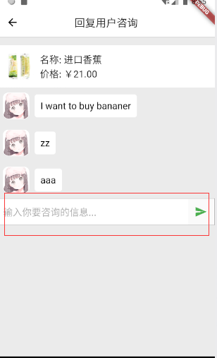
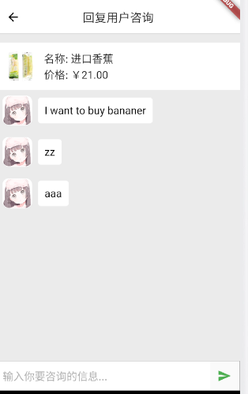

关于咨询页面布局的一些问题
-----
##### 1、没有再次嵌套Column和Flexible代码
```
Widget _getBodyWidget() {
    return Column(
      children: <Widget>[
        _getGoodsWidget(),
        Flexible(
          child: StreamBuilder(
            stream: bloc.chatMsgListStream,
            initialData: new List<ChatMsg>(),
            builder: (BuildContext context, AsyncSnapshot<List<ChatMsg>> snapshot){
              int len = snapshot.data.length;
              List<ChatMsg> msgList = snapshot.data;
              //没有再次嵌套Column和Flexible代码
             return ListView.builder(
               //倒置过来的ListView，这样数据多的时候也会显示“底部”（其实是顶部），
               //因为正常的listView数据多的时候，没有办法显示在顶部最后一条
               reverse: true,
               itemCount: len,
               //如果只有一条数据，因为倒置了，数据会显示在最下面，上面有一块空白，加column就是解决这个问题的
               //listView高度由内容决定
               shrinkWrap: true,
               itemBuilder: (BuildContext context, int index){
                 ChatMsg msg = msgList[index];
                 if(msg.msgType == 1) {
                   return _UserMsg(user.avatar, msg);
                 }else{
                   return _AdminMsg(admin.avatar, msg);
                 }
               },
             );
            },
          ),
        ),
        _getSendWidget(),
      ],
    );
}
```
显示效果<br>


##### 2、嵌套了Column和Flexible的代码
```
Widget _getBodyWidget() {
    return Column(
      children: <Widget>[
        _getGoodsWidget(),
        Flexible(
          child: StreamBuilder(
            stream: bloc.chatMsgListStream,
            initialData: new List<ChatMsg>(),
            builder: (BuildContext context, AsyncSnapshot<List<ChatMsg>> snapshot){
              int len = snapshot.data.length;
              List<ChatMsg> msgList = snapshot.data;
              //再次嵌套Column和Flexible代码
              return Column(
                children: <Widget>[
                  Flexible(
                    child: ListView.builder(
                      //倒置过来的ListView，这样数据多的时候也会显示“底部”（其实是顶部），
                      //因为正常的listView数据多的时候，没有办法显示在顶部最后一条
                      reverse: true,
                      itemCount: len,
                      //如果只有一条数据，因为倒置了，数据会显示在最下面，上面有一块空白，加column就是解决这个问题的
                      //listView高度由内容决定
                      shrinkWrap: true,
                      itemBuilder: (BuildContext context, int index){
                        ChatMsg msg = msgList[index];
                        if(msg.msgType == 1) {
                          return _UserMsg(user.avatar, msg);
                        }else{
                          return _AdminMsg(admin.avatar, msg);
                        }
                      },
                    ),
                  ),
                ],
              );
            },
          ),
        ),
        _getSendWidget(),
      ],
    );
}
```
显示效果<br>


##### 3、为什么会这样
```
暂时不知道
```
```
关于撑开剩余空间，可以使用Expanded,这个在此布局中还未验证
```
[关于Flexible和Expanded的区别可以参考这个](https://blog.csdn.net/chunchun1230/article/details/82460257)
